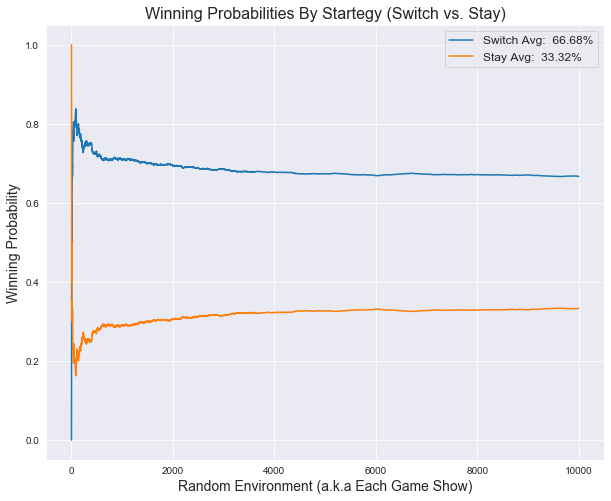

# The Monty Hall Problem
The Monty Hall Problem is a famous game show problem which involves a host, a contestant, three doors, 2 goats, and 1 Ferrari. The game show goes like this:

The contestant picks any door (1, 2, or 3). Let's say this is door 1.

The host then reveals what is behind one of the doors that is not selected and not surprisingly it is a goat. Let's say this is door 3. So door 1 (the contestant's original selection) and door 2 (the door that has yet to be revealed) are still in play.

The host then asks the contestant if they want to stay with the original guess, door 1 in our example, or switch to the remaining door, which is door 2 in our example.

What would you do? Would you stay with your original guess of door 1 or would you switch to door 2? What is probability of winning the Ferrari if you stay? What is the probability if you switch? If you said that your probability increases from 1/3 to 1/2 if you stay, and should therefore stay, sorry you're wrong! That isn't to say you won't win if you stay, in fact you should win approximately 1/3 of the time. However, if you consistently (and blindly) switch your pick after the host reveals the first goat, your probability of winning increases to 2/3.

Let's think about this logically for a second. One major key to this problem is that the host will never reveal which door the Ferrari is behind (this is a game show after all so we must keep the audience's interest!). So with that understanding, let's assume that you choose to implement the strategy of blindly switching to the other door with your 2nd attempt. For you to win (i.e., select the door hiding the Ferrari with your second guess), you would have had to first select a goat so that you could switch to the Ferrari. Remember, the host is never going to reveal which door the Ferrari is behind thus eliminating one of the goats. What is the probability of selecting a goat at the beginning? That's right; it is 2/3! With the swithcing strategy, in order for you to lose (i.e., select the door hiding the goat with your second guess), you would have to originally selected the Ferrari. The probability of doing so is 1/3. Note, that the probability of winning should you stay each time is equal to one minus the probability of winning if you switch each time, or simply: P(Stay_Winning) = 1 - P(Switch_Winning) = 1 - 2/3 = 1/3.

Please explore the jupyter notebook for the solution. The graph plot plots the winning probability for each the "environments."

